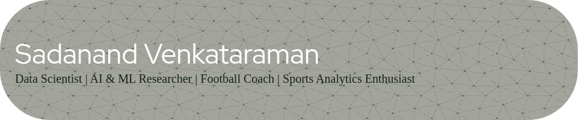

---

Welcome to my GitHub! I'm Sadanand, a data science enthusiast with a passion for merging AI and sports analytics. With hands-on experience in machine learning, research, and coaching, I'm focused on uncovering insights that drive decision-making in football and beyond.

---

## About Me 🧑‍💻
- **Current Role**: M.Tech in Artificial Intelligence & Data Science at Shiv Nadar University, Chennai
- **Background**: Bachelor's in AI & Machine Learning | Football Coach with AIFF D License
- **Research Interests**: Cognitive Analytics, Sports Analytics, Data Science, AI in Sports
- **Projects**: Focused on using AI to elevate sports performance, decision-making, and talent identification.

---

## What I’m Working On 🚀
- **AI in Football Analytics**: Developing cognitive models to analyze and support player development.

---

## Featured Projects 💡

### AI & Data Science

| Project | Description | Language |
| ------- | ----------- | -------- |
| [Timetable Scheduler](https://github.com/sadanandv/Timetable-Scheduler-using-Genetic-Algorithm) | Academic timetable generator using genetic algorithms | Python |
| [PremPredict](https://github.com/sadanandv/PremPredict) | Predictive analysis for football | Jupyter Notebook |
| [Basic RAG](https://github.com/sadanandv/Basic-RAG) | Retrieval-Augmented Generation implementation with BERT and BART | Python |
| [Semantic Segmentation Football](https://github.com/sadanandv/Semantic_Segmentation_Football) | Optimizing segmentation for football analytics | Python |

### Data Scraping

| Project | Description | Language |
| ------- | ----------- | -------- |
| [Transfermarkt Scraper](https://github.com/sadanandv/transfermarkt-scraper) | Extracts football transfer data from Transfermarkt | Python |
| [Google Scholar Data Collector](https://github.com/sadanandv/Google-Scholar-Data-Collector) | Extracts key information from a scholar's profile | Python |

### Shiv Nadar University Chennai Courses

| Project | Description | Language |
| ------- | ----------- | -------- |
| [CS5002 High-Performance Architectures](https://github.com/sadanandv/CS5002High-Performance-Architectures-for-AI) | Parallel programming examples using OpenMP and MPI | C++ |
| [CS5702 Advanced Data Structures](https://github.com/sadanandv/CS5702AdvancedDataStructures-Algorithms) | Topics from the advanced data structures course | C |
| [CS5703 Reinforcement Learning and Multiagent Systems](https://github.com/sadanandv/CS5703-Reinforcement-Learning-and-Multiagent-Systems) | Course materials on RL and multi-agent systems | Jupyter Notebook |
| [CS5701 Foundations for Data Engineering](https://github.com/sadanandv/CS5701-Foundations-for-Data-Engineering) | Foundational topics in data engineering | Jupyter Notebook |

---
## Publications 📚

1. **Venkataraman, S., Malakreddy, B., Khan, M. S., & Padmanabhuni, S.** (2024). "Beyond the pixels: Elevating sports analysis via AI explainability in semantic segmentation." *Nvidia GTC*.
   

2. **Venkataraman, S., Sundharakumar, K., Malakreddy, A. B., & Natarajan, S.** (2024). "Decoding the psyche: Engineering psychological profiles in football through YODA analysis." *ISEA – The Engineering of Sport 15*, Loughborough University, UK.
   

3. **Venkataraman, S., Sundharakumar, K., Malakreddy, A. B., & Natarajan, S.** (2024). "YUVA-SQ: A cognitive scouting model for the beautiful game." *5th International Conference on Innovative Trends in Information Technology (ICITIIT)*.
   

4. **Venkataraman, S., Sundharakumar, K., Malakreddy, A. B., & Natarajan, S.** (2024). "Unveiling the mental game: Leveraging YODA psychometry in football performance analysis." *ANZIM – Journal of the Australian Mathematical Society*, Trobe University, Melbourne, Australia.
   

5. **Venkataraman, S., Sundharakumar, K., Malakreddy, A. B., & Natarajan, S.** (2024). "YUVA-SQ: Scouting intelligent minds for the beautiful game." *Society for Brain Mapping & Therapeutics*, Los Angeles, CA, USA.
   

6. **Malakreddy, B., Venkataraman, S., Khan, M. S., & Padmanabhuni, S.** (2023). "Recent advances in semantic segmentation for sports analytics." *ICT Infrastructure and Computing*, Springer Nature Singapore.
   

7. **Venkataraman, S., Natarajan, S., & Malakreddy, A. B.** (2023). "YUVA-SQ: Scouting intelligent minds for the beautiful game." *Carnegie Mellon Sports Analytics Conference*.
   

8. **Malakreddy, B., Venkataraman, S., Khan, M. S., & Padmanabhuni, S.** (2024). "Optimizing semantic segmentation for enhanced football analytics: A pixel-level approach." *International Conference on Machine Learning and Data Engineering (ICMLDE)*.
   

9. **Venkataraman, S., Sundharakumar, K., Malakreddy, A. B., & Natarajan, S.** (2024). "An AI-driven approach to the guessing game: Leveraging LLAMA-3.1." *Taylor’s University, Malaysia*.
   

1. **B. Malakreddy A, M. S. Khan, Nidhi, S. Venkataraman, and S. Padmanabuni**,(2024) “_Beyond the pixels: Elevating sports analysis via ai explainability in semantic segmentation_”, in *Nvidia GTC, 2024*. 
   

2 B. Malakreddy A, S. Venkataraman, M. S. Khan, Nidhi, S. Padmanabhuni, and S. Natarajan,
“Optimizing semantic segmentation for enhanced football analytics: A pixel-level approach,”
International Conference on Machine Learning and Data Engineering (ICMLDE 2023), vol. 235, 2024,
pp. 2662–2673.
3 M. Palaniappan, V. Sadanand, K. Sundharakumar, A. B. Malakreddy, and S. Natarajan, “An ai-driven
approach to the guessing game: Leveraging llama-3.1,” Taylor’s University, Malaysia, 2024.
4 S. Venkataraman, K. Sundharakumar, A. Bharathi Malakreddy, and S. Natarajan, “Yuva-sq: A
cognitive scouting model for the beautiful game,” in 2024 5th International Conference on Innovative
Trends in Information Technology (ICITIIT), 2024, pp. 1–6.
5 S. Venkataraman, K. Sundharakumar, A. B. Malakreddy, and S. Natarajan, “Decoding the psyche:
Engineering psychological profiles in football through yoda analysis,” in ISEA 2024 – The Engineering of
Sport 15, Loughborough University, UK, 2024.
6 S. Venkataraman, K. Sundharakumar, A. B. Malakreddy, and S. Natarajan, “Redefining talent
identification in football: The yuva-sq model,” Indian Institute of Management, Udaipur, India, 2024.
7 S. Venkataraman, K. Sundharakumar, A. B. Malakreddy, and S. Natarajan, “Unveiling the mental
game: Leveraging yoda psychometry in football performance analysis,” in ANZIM- The journal of the
Australian Mathematical Society, Trobe University, Melbourne, Australia, 2024.
8 S. Venkataraman, K. Sundharakumar, A. B. Malakreddy, and S. Natarajan, “Yuva-sq: Scouting
intelligent minds for the beautiful game,” Society for Brain Mapping & Theraputics, Los Angeles, CA,
USA, 2024.
9 A. B. Malakreddy, S. Venkataraman, M. S. Khan, and S. Padmanabhuni, “Recent advances in semantic
segmentation for sports analytics,” in ICT Infrastructure and Computing, M. Tuba, S. Akashe, and
A. Joshi, Eds., Singapore: Springer Nature Singapore, 2023, pp. 275–285, isbn: 978-981-99-4932-8.
10 S. Venkataraman, S. Natarajan, and B. M. A, “Yuva-sq: Scouting intelligent minds for the beautiful
game,” Accepted for Poster Presentation at CMSAC 2023, Carnigie Mellon University, Pittsburg, PA,
2023.

---

## Let’s Connect 🤝
If you're passionate about AI in sports, data-driven insights, or just want to chat about football, feel free to reach out!

- **LinkedIn**: [Sadanand Venkataraman](https://www.linkedin.com/in/sadanand-venkataraman/)
- **Email**: saadanandv@gmail.com

---

*“Bridging AI and Football to Unlock Game-Changing Insights”*
